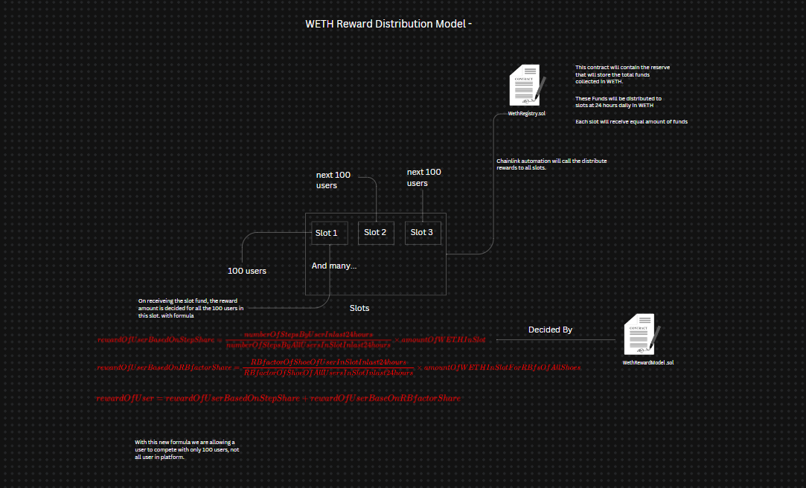

# RunBro: Decentralized Fitness Marketplace

RunBro is a decentralized platform that rewards users for their physical activity by integrating the Google Fit API with a unique reward model. Users can buy and sell fitness-related items (such as shoes) while earning native tokens (RBT) based on their steps.

## Team

Our team is composed of passionate individuals dedicated to making RunBro a success. If you have any questions or would like to contribute to the project, please feel free to reach out.

### Core Contributors
- **Shubham** - *Smart Contracts* - [github://orangesantra](https://github.com/orangesantra)
- **Jaka** - *Front-End* - [github://BChainbuddy](https://github.com/BChainbuddy)
- **Charles** - *Project Manager* - [github://SupaMega24](https://github.com/SupaMega24)
- **Susan** - *Marketing/Design* - [github://2RowFlow](https://github.com/2RowFlow)

## High Level Architecture

Here’s an enhanced version of the content for your README file:

---

## In-depth Architecture

## Components

### 1. **RunBroToken Contract**
- **Purpose**: Implements an ERC20 token with advanced features like ownership control, permits, and voting.
- **Key Features**:
  - Minting and burning capabilities.
  - Secure transfers restricted to the owner.
  - Integration with OpenZeppelin's contracts for added functionalities.

### 2. **MarketPlace Contract**
- **Purpose**: Enables the listing and purchasing of shoes using WETH and RunBroToken.
- **Key Features**:
  - User and seller registration.
  - Order and payment management via escrow.
  - Activity-based reward distribution.

### 3. **GetStepsAPI Contract**
- **Purpose**: Fetches daily step data using Chainlink Functions.
- **Key Features**:
  - Retrieves and stores user step data.
  - Distributes rewards based on steps.
  - Ensures secure data fetching.

### 4. **Escrow Contract**
- **Purpose**: Secures transactions between buyers and sellers.
- **Key Features**:
  - Holds funds until transaction completion.
  - Releases funds to sellers upon successful transactions.

### 5. **WethRegistry Contract**
- **Purpose**: Manages user slots and rewards based on reserve balance.
- **Key Features**:
  - User slot management.
  - Reserve balance updates.
  - Reward distribution using Chainlink Automation.

  

### 6. **WethReward Contract**
- **Purpose**: Manages rewards distribution based on user activity.
- **Key Features**:
  - Step data fetching and recording.
  - WETH-based reward calculations.
  - Integration with other ecosystem contracts.

### 7. **DeployContracts Script**
- **Purpose**: Deploys and initializes all necessary smart contracts.
- **Key Features**:
  - Deploys core and DAO-related contracts.
  - Configures DAO roles and permissions.

---

## Chainlink Integration

### Chainlink Functions

- Chainlink functions fetch data from the Google Fit API to retrieve step counts.
https://functions.chain.link/

### Chainlink Automation

- Chainlink is used to distribute the rewards to all available Slots on the platform every 24 hours (12:00 AM daily), which can be lated used to distribute rewards to all the users in a Slot.
https://automation.chain.link/

## User Flow

1. A seller lists a shoe, paying the platform fee.
2. The shoe appears on the marketplace with its price, RB Factor, brand name, and shoe name.
3. A buyer purchases the shoe, paying the price to the seller.
4. The buyer becomes eligible to claim rewards based on their steps.
5. After a specified duration (D), the user can calculate and claim their reward based on their steps and the total steps recorded by all users during D.

## Incentives

- **Buyer**: Earns rewards based on their steps when buying from the RunBro platform.
- **Seller**: Shoes sell quickly on RunBro, and sellers don't need to offer high discounts since buyers control their profit/loss based on steps.

---

## Tech Stack

### JavaScript
- **Frontend**: Our user interface is built using Next.js, a React framework that enables server-side rendering and generating static websites for React-based web applications.
- **Styling**: We use Tailwind CSS for styling, which provides a utility-first approach to design our components efficiently.

### Solidity
- **Smart Contracts**: Our core blockchain functionality is powered by Solidity, the contract-oriented programming language for writing smart contracts on various blockchain platforms.

### Foundry
- **Testing**: We use Foundry, a blazing fast, portable, and modular toolkit for Ethereum application development, to test our smart contracts ensuring security and reliability.
  
## Contributing

We welcome contributions from the community.

1.	Fork the repository.
2.	Create a new branch: git checkout -b feature/my-feature.
3.	Commit your changes: git commit -am 'Add my feature'.
4.	Push to the branch: git push origin feature/my-feature.
5.	Submit a pull request.

## License
RunBro is released under the MIT License. See the LICENSE file for more details.
